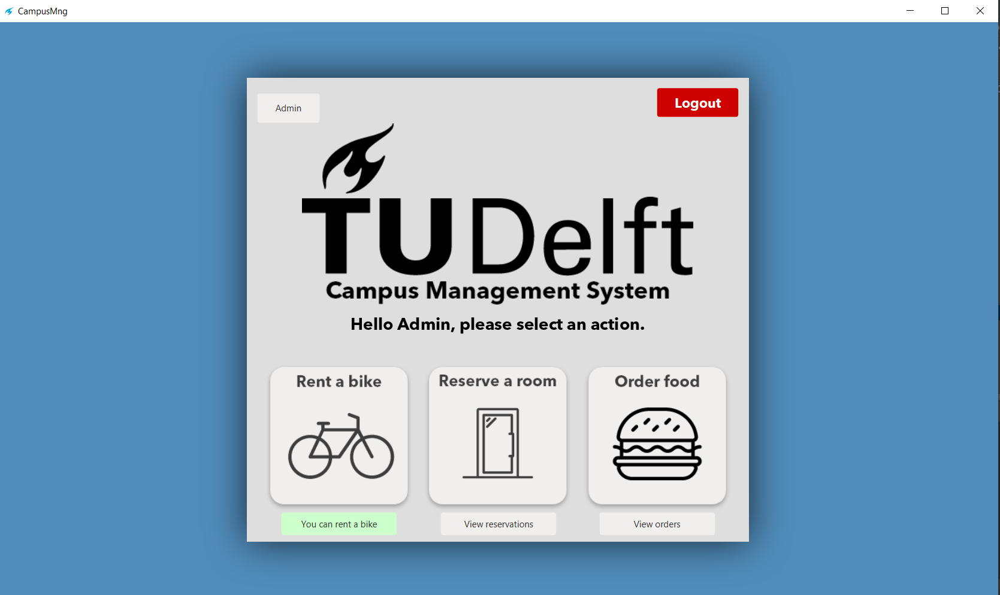
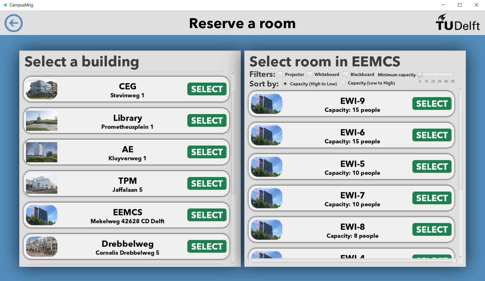
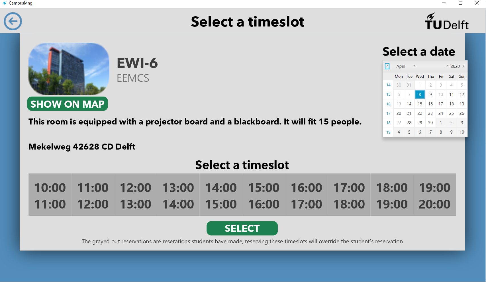

# Campus-Mangament-System
 A group project for one of our university courses 

## Description of project
	WIP: Campus management software with ability to rent rooms for certain timeslots, as well as renting bikes 
	

## Architecture
The program is split up into three main layers:  
•Client-side/frontend  
•Server-side/backend  
•Database  
 MVC design pattern is used for the front end and JavaFX framework to implement the UI. The frontend accesses the backend through http requests to rest API endpoints. The backend uses Spring framework and Spring JPA ( Java Persistence API) that simplifies repository’s implementation. This makes our data access layer extremely easy to maintain. Database is created using MySql, and it is hosted online by a cloud hosting provider called DigitalOcean.
 
## Built with
Gradle - Dependency Management  
JDK - Java™ Platform, Standard Edition Development Kit  
Spring Boot - Framework to ease the bootstrapping and development of new Spring Applications  
MySQL - Open-Source Relational Database Management System  
JavaFx - Framework to implement the UI  
GSON - Library to serialize and deserialize Java objects to JSON.  

## Demo
 

